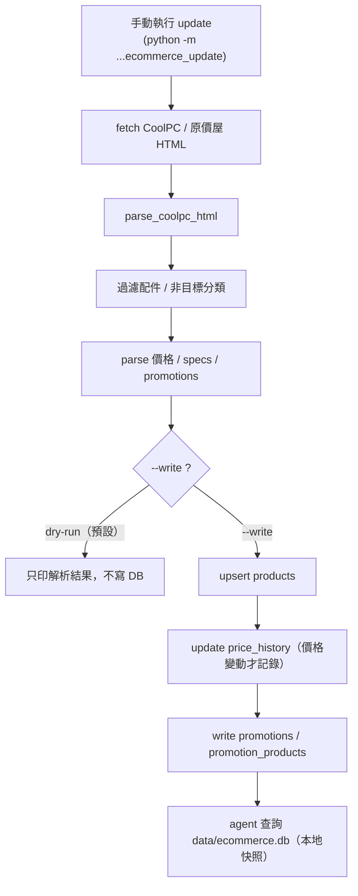

# PC Builder Agent

## 簡介

PC Builder Agent 是一個以節點（node）與工具（tool）為核心的模組化系統，用於根據使用者偏好與需求，提供 PC 組裝建議、爬取討論版文章、以及多角色代理（agent）式的互動流程。

這是一個使用 LangGraph 建立的 multi-agent 起始範例，現在已串接 GPT API、工具呼叫與記憶體。

它會使用同一個 session id 同時保存短期對話記憶與偏好資料，方便你重跑同一組設定時延續上下文。

### 重點功能

- **節點（Nodes）**：每個 node 負責一個職責（例如：爬蟲、專家回答、整合器等）。
- **工具（Tools）**：輔助功能模組，可供 agent 呼叫（例如：爬蟲模擬、硬體資訊查詢）。
- **狀態（state）**：中心化的作業狀態（包含 `preferences`、`profile_id` 等），節點間傳遞與共享。

## 專案目錄（概要）

- **`main.py`**: 程式進入點（示範或 CLI 啟動）。
- **`pyproject.toml`**: 專案相依與建構設定。
- **`pc_builder_agent/`**: 主程式套件目錄。
  - **`nodes/`**: 節點實作目錄（例如爬蟲、專家、整合器）。
  - **`tools/`**: 工具集合（給 agent 呼叫的外部功能或模擬器）。
  - **`chatbot.py`, `cli.py`**: 與使用者互動的入口元件。
  - **`data/articles/`**: 預設或已儲存的文章資料。


## 運作流程（可直接到graph.py查看詳細流程）

1. 首先從`preference.json`讀取使用者的偏好
2. 根據偏好與需求呼叫`pc_board_scraper` 爬蟲 node，來爬取文章
3. 進入chat模式，使用者透過 CLI 或 chat 介面發出需求。
4. Router 決定需要啟動哪些 node（例如：若需要最新討論則啟動 `pc_board_scraper`）。
5. Node 呼叫 `run_agent_turn()` 與 LLM 互動，並可選擇呼叫 `tools` 提供的功能（例如 `pc_board_scraper.invoke()`）。
6. Node 處理結果並回寫到 `state`。
7. 最終由`integrator node` 或回應流程將結果呈現給使用者。

## 開發與執行

```bash
# 建立/同步虛擬環境並安裝相依
uv sync

# 執行主程式（範例）
uv run main.py

# 若要執行debug模式(輸出更多提示訊息)
uv run main.py --debug
```

程式會在啟動時自動讀取專案根目錄的 `.env`，請直接把 `OPENAI_API_KEY` 放進去。

如果想指定模型，也可以設定`OPENAI_MODEL`

### 如何新增一個 Node（節點），範例請參考 node_template.py

1. 在 `pc_builder_agent/nodes/` 下新增檔案，例如 `my_new_node.py`。
2. 節點應實作一個主函式（習慣命名為 `<name>_node(state, *, model_name=None, debug=False)`），並回傳明確的字典結果。
3. 節點可使用 `run_agent_turn()` 與 LLM 互動；必要時把工具（tool）傳入 `tools=[...]`。

注意事項：
- 回傳格式應該一致且可被 router 或其他 node 消費（例如包含 `messages`、或 `response` 欄位）。

### 如何新增一個 Tool（工具），範例請參考 tool_template.py

1. 在 `pc_builder_agent/tools/` 下新增檔案並在 `__init__.py` 中匯出工具。


工具使用建議：
- 工具應保持純粹、單一職責，並避免直接修改 global state；node 負責串接工具結果並決定是否儲存。


## 共同開發流程

- 加入Collaborators → 建 feature branch → 開發並加上測試 → 發 PR。
- PR 記得描述：新增的 node/tool 目的、輸入輸出格式、必要的 state 欄位。

### 範例：測試 Node（router 範例）

示範如何直接呼叫單一 node（router），用於快速驗證路由邏輯。此腳本會對三個範例請求執行 `router_node`，並印出 `route_targets` 與 `route_reason`。

執行方式（在專案根目錄）：

```bash
uv run scripts/test_node.py
```

如果要查看或修改測試腳本，請參考專案根目錄下的 `scripts/test_node.py`。

---

## Ecommerce Recommendation Node

### 用途

`ecommerce` node 是一個電子商城商品推薦專家，負責：

- 查詢電子商城商品（依關鍵字、類別、品牌、價格區間）
- 查詢商品價格
- 尋找優惠：單品特價、以及價格低於同類平均價的商品

支援的零組件類別（8 類主流程）：

```text
CPU / GPU / Motherboard / RAM / Storage / PSU / Case / Cooler
```

- **Storage**：包含 SSD / HDD / M.2 / SATA / NVMe 等內接儲存裝置；**不含**隨身碟、記憶卡、外接硬碟。
- **Case**：包含機殼本體；**不含**機殼風扇、機殼配件（螺絲 / 側板 / 濾網 / 支架）。
- **Cooler**：CPU 散熱器，包含**空冷塔散**與 **AIO 水冷**；**不含**散熱膏 / 散熱墊 / SSD・M.2 散熱片 / 筆電散熱墊 / 機殼風扇 / 扣具・支架・配件。
- 完整菜單查詢會把 **Cooler** 納入候選類別。
- **Cooler 相容性提醒**：空冷「高度」需確認機殼支援、AIO「水冷排尺寸」需確認機殼支援、CPU socket「扣具」需確認 CPU/主機板平台支援。

> ℹ️ 資料來源有兩種：**seed demo data（示範資料，僅 CPU/GPU/Motherboard）** 與 **CoolPC（原價屋）真實資料更新流程（涵蓋上述 8 類）**。其餘商城（欣亞 / PChome / momo）尚未實作。

### 新增的檔案與責任

| 檔案 | 責任 |
| --- | --- |
| `pc_builder_agent/tools/ecommerce_db.py` | SQLite 資料層：`init_db` / `upsert_products` / `query_products` / `find_deals` / `load_seed_products` / `sanitize_product_for_llm`；**promotions 相關**：`rebuild_promotions` / `list_promotions` / `get_promotions_for_product` / `attach_promotions_to_products` / `build_promotion_summary` / `estimate_promotion_adjusted_total` / `find_compatible_bundle_discount_pairs`。 |
| `pc_builder_agent/tools/ecommerce_seed.py` | 示範資料 `DEFAULT_SEED_PRODUCTS`（CPU / GPU / Motherboard 共 24 筆）。 |
| `pc_builder_agent/tools/ecommerce_scraper.py` | CoolPC 抓取與解析：`fetch_coolpc_html()`（單次低頻請求）+ `parse_coolpc_html()`（類別/型號/降價/配件過濾）+ `parse_coolpc_promotions()` / `parse_promotion_signals()`（優惠訊號解析）。 |
| `pc_builder_agent/tools/ecommerce_update.py` | 手動更新流程：`update_coolpc_products()`（fetch → parse → upsert，支援 dry-run / fallback；預設一併寫入 promotions，可用 `--no-promotions` 關閉）。非 LLM tool。 |
| `pc_builder_agent/tools/ecommerce_tools.py` | 五個 LangChain `@tool`：`search_ecommerce_products`、`find_ecommerce_deals_tool`、`recommend_pc_build_tool`、`search_ecommerce_promotions`、`find_bundle_discount_pc_pairs`。 |
| `pc_builder_agent/nodes/ecommerce.py` | `ecommerce_node`：用 `run_agent_turn()` 串接上面兩個 tool 並產生繁中建議。 |
| `pc_builder_agent/graph.py` | 新增 `ecommerce` node、`ecommerce -> integrator` 邊、`BuildState` 加 `ecommerce_advice` / `ecommerce_db_path`。 |
| `pc_builder_agent/nodes/router.py` | router 可路由到 `ecommerce`（含 LLM prompt 與關鍵字 fallback）。 |
| `pc_builder_agent/nodes/integrator.py` | 最終整合時納入 `ecommerce_advice`。 |

### 資料庫（database）

- 使用 **SQLite**，為**本地端**資料庫，不是線上 DB。
- 預設路徑為 `data/ecommerce.db`（相對於專案根目錄）。
- **目前不會自動建立**，需手動匯入 seed data（見下方）。
- DB 檔已列入 `.gitignore`（`data/*.db` 等），不會進版控。

### 如何手動建立本地 seed DB

在專案根目錄執行（會建立 `data/ecommerce.db`）：

```bash
uv run python -c "from pc_builder_agent.tools import ecommerce_db as db; print(db.load_seed_products('data/ecommerce.db'))"
```

說明：

- 執行後會在專案根目錄建立 `data/ecommerce.db`。
- 這是本地端 SQLite 檔案。
- 這份 DB 含 **demo seed data**（含「原價屋」「欣亞」示範來源）。

### 如何用 CoolPC（原價屋）真實資料更新 DB

`ecommerce_update` 會從 CoolPC 公開估價頁抓取、解析後寫入本地 DB（手動觸發，非自動排程）。

先 dry-run（只抓取＋解析，**不寫任何 DB**，每類別最多 20 筆）：

```bash
uv run python -m pc_builder_agent.tools.ecommerce_update --max-per-category 20
```

確認結果合理後，正式寫入本地 DB（完整解析結果）：

```bash
uv run python -m pc_builder_agent.tools.ecommerce_update --write --db-path data/ecommerce.db
```

說明與注意事項：

- 正式寫入會涵蓋 **8 類**（CPU / GPU / Motherboard / RAM / Storage / PSU / Case / Cooler）的 CoolPC 真實商品；本地實測約為 **2,300 多筆**，實際數量會**依 CoolPC 頁面當下內容變動**。
- `data/ecommerce.db` 是**本地 SQLite 檔案**，已被 `.gitignore` 排除，**不會上傳 GitHub**。
- 因此 **clone 專案後需自行執行上面的 update 指令**建立本地 DB（否則 ecommerce 查詢會回「資料庫沒有商品資料」）。
- CoolPC 資料來自其**公開估價頁**，以單次、低頻、誠實 User-Agent 抓取，不繞過任何限制。
- CoolPC 資料是**手動更新的本地快照，不是即時報價**；CoolPC **HTML 結構改版可能導致 parser 失效**，屆時需更新 `ecommerce_scraper.py`。
- 更新為**手動觸發**，沒有自動排程。
- 抓取失敗或解析為空時**不會覆蓋既有 DB**；加上 `--fallback-to-seed` 可在失敗時改用 seed data。
- 若要避免把 seed 示範資料與 CoolPC 真實資料混在一起，建議**先備份再用乾淨 DB 重建**（例如把舊 `data/ecommerce.db` 複製成 `data/ecommerce_seed_backup_*.db` 後再 `--write`；備份檔同樣被 `.gitignore` 排除）。

### Manual local DB update（手動更新本地 DB）

本專案**不做** OS cron / systemd 等自動定時更新;`data/ecommerce.db` 一律由使用者**手動**在本地端建立或更新。

重點:

1. `data/ecommerce.db` 是**本地 SQLite DB**,已被 `.gitignore` 排除,**不會上傳 GitHub**。
2. **clone 專案後,需自己在本地端建立或更新 DB**(否則 ecommerce 查詢會回「資料庫沒有商品資料」)。
3. 更新 DB **不需要重跑整個 agent**,只要執行 `ecommerce_update` module 即可。
4. **dry-run**(只抓取＋解析,**不寫任何 DB**):

```bash
uv run python -m pc_builder_agent.tools.ecommerce_update
```

5. **正式寫入**本地 DB:

```bash
uv run python -m pc_builder_agent.tools.ecommerce_update --write --db-path data/ecommerce.db
```

6. **建議正式寫入前先備份**(備份檔同樣被 `.gitignore` 排除):

```bash
cp data/ecommerce.db data/ecommerce_manual_backup_$(date +%Y%m%d_%H%M%S).db
```

7. update 流程(`--write` 時):
   - fetch CoolPC / 原價屋 估價頁 HTML
   - `parse_coolpc_html` 解析 8 類零組件(過濾配件 / 非目標分類)
   - 解析價格 / specs / promotions(優惠訊號)
   - `upsert_products`(寫入 / 更新商品)
   - 更新 `price_history`(僅在價格變動時記錄)
   - 寫入 `promotions` / `promotion_products`(預設一併寫入;可加 `--no-promotions` 關閉)
   - 之後 agent 查詢的就是本地 `data/ecommerce.db`

8. 這**不是即時查價**;資料是**本地快照**,實際價格仍以商城頁面為準。
9. 若 **CoolPC 網頁改版**,parser 可能需要更新(`ecommerce_scraper.py`)。
10. 目前真實商城資料來源為 **CoolPC / 原價屋**;**欣亞 / PChome / momo 尚未實作**。

#### 更新流程圖



> 提醒:`data/ecommerce.db` 不進 Git,**每個環境都要各自建立本地 DB**;`--write` 會**連線到 CoolPC / 原價屋**公開估價頁(單次、低頻、誠實 User-Agent)。

#### First-run(第一次 clone)行為

第一次 clone 後本地 `data/ecommerce.db` **尚不存在**。此時:

- 各 ecommerce 工具(`search_ecommerce_products` / `find_ecommerce_deals_tool` / `recommend_pc_build_tool` / `search_ecommerce_promotions` / `find_bundle_discount_pc_pairs`)**不會報錯、不會自動建立 DB、不會自動爬網、也不會編造商品**;而是回傳清楚訊息,提示先執行上面的 **update 指令**建立本地 DB。
- DB 存在但**沒有任何商品**(只有 schema)時,工具同樣會提示先執行 update 匯入商品。
- **沒有建立本地 DB 時,agent 無法查到真實商品**(完整菜單 / 優惠查詢都會請你先建立 DB)。
- `load_seed_products()` 的 **seed demo data 僅為 fallback / 示範**(少量 CPU/GPU/Motherboard),**不是正式商品資料**;正式商品請用上面的 CoolPC update 指令建立。

### 如何測試 ecommerce tools

建立 seed DB 後，可直接呼叫工具驗證：

```bash
# 查詢商品
uv run python -c "from pc_builder_agent.tools.ecommerce_tools import search_ecommerce_products; print(search_ecommerce_products.invoke({'keyword':'RTX 4060','db_path':'data/ecommerce.db'}))"

# 查詢優惠
uv run python -c "from pc_builder_agent.tools.ecommerce_tools import find_ecommerce_deals_tool; print(find_ecommerce_deals_tool.invoke({'category':'GPU','db_path':'data/ecommerce.db'}))"
```

> 若想在不污染專案的情況下測試，可改用 Python `tempfile` 建立臨時 DB，把 `db_path` 指向臨時路徑即可。

### 如何在正式對話中使用

啟動聊天模式後（`uv run main.py`），可以問：

- 「幫我找 RTX 4060 的優惠」
- 「預算 10000 以內找 GPU」
- 「幫我比較原價屋和欣亞的 RTX 4060」

提醒：

- 若尚未建立 `data/ecommerce.db`，系統會回覆「資料庫沒有商品資料」，並不會虛構商品。
- 若沒有設定 `OPENAI_API_KEY`，無法執行完整的 LLM 對話流程。

### 完整菜單推薦（recommend_pc_build_tool）

ecommerce node 不只會查單一商品，當使用者要求「配一台電腦 / 完整菜單 / 遊戲機 / 主機 / 組電腦」並給預算時，會呼叫 **deterministic 完整菜單工具 `recommend_pc_build_tool`**(定義於 `ecommerce_tools.py`,核心邏輯在 `ecommerce_db.recommend_pc_build()`)。

該工具會回傳一套**平台一致**的完整 build:

```text
CPU / GPU / Motherboard / RAM / Storage / PSU / Case / Cooler
total_price / budget_min / budget_max / budget_usage_percent / in_budget_range
compatibility(相容性摘要) / warnings / explanation
```

**預算策略**：

- 正常情況下,總價會盡量落在使用者預算的 **80%～120%**(例:預算 30000 → 目標 24000～36000)。
- 若需求與預算明顯不合理,**不會硬湊** 80%～120%:
  - 例:**50000 元文書機** → 提醒預算過高(文書合理約 16000),不硬湊。
  - 例:**10000 元 4K 遊戲機** → 提醒預算不足(4K 建議 40000 以上),不硬湊。

**gaming build 最低選品策略**：

- **RAM**:優先 DDR4 / DDR5,**至少 16GB**(不主推 8GB 單條 / DDR3)。
- **Storage**:約 **500GB 級距以上**(480GB / 500GB / 512GB / 1TB SSD),不主推 240GB / 256GB。
- **PSU**:有獨顯時優先 **550W / 650W / 750W**(不主推 400W / 450W)。
- **Cooler**:只從 `category="Cooler"` 選(空冷或 AIO),不含散熱膏 / SSD 散熱片 / 機殼風扇等配件。
- **CPU / MB / RAM**:用 specs 的 `socket` / `memory_generation` 做基本相容性檢查。

**硬體邏輯守門(deterministic,Final-QA 後)**：

`recommend_pc_build_tool` 在選 build 時會套用下列守門,避免明顯不合理或不相容的配置:

- **CPU socket 必須與 Motherboard socket 相符**。
- **Motherboard memory_generation 必須與 RAM memory_generation 相容**(選 RAM 時過濾 + 回傳前再次最終守門,不相容則放棄該平台)。
- **LGA1700 D4 / D5 主機板**:部分主機板以 `D4` / `D5` 表示 DDR4 / DDR5 版本;`recommend_pc_build` 會用**商品名稱 fallback** 判斷(名稱明確的 DDR4/DDR5/D4/D5 優先),修正 DB specs 模糊或舊誤標(例如 `H610I-PLUS D4-CSM` 視為 DDR4),避免 MB/RAM 世代錯配。
- **gaming / 4k_gaming 的主要 Storage 必須是 SSD 類型**(SSD / NVMe / M.2 / PCIe SSD / 2.5吋 SSD),**不會只因容量夠大就選純 HDD**;容量至少約 **480GB**。純 HDD(5400/7200轉、新梭魚、3.5吋)可作為**資料碟**,但**不應作為唯一主要 Storage**。
- **搭獨立顯卡時 PSU 至少約 550W**。
- **display output guard:無 GPU 的 build 必須確認 CPU 有內顯**;文書機可以沒有獨顯,但 CPU 必須有內顯。若 CPU 無內顯或無法確認(例如 Intel/AMD 的 **F 結尾型號** 如 i5-12400F / R5 8400F / R5 7500F),系統會優先**改選有內顯的 CPU**(如 AMD G/GT、Intel 非 F),找不到時才**加入一張便宜 GPU**;`compatibility` / `warnings` 會說明顯示輸出來源。

**相容性檢查程度**：

- 已做(deterministic):上述硬體邏輯守門(socket / 記憶體世代 / D4-D5 fallback / SSD 主儲存 / PSU 瓦數 / 顯示輸出)。
- **尚未檢查**:BIOS 版本相容性、機殼長度/高度細節、GPU 長度、Cooler 高度、AIO 水冷排安裝位置、PSU 接頭/顯卡供電需求、主機板 VRM/供電品質與擴充性,以及 PCPartPicker 等級的完整相容性。
- 因此完整菜單仍應視為**商城候選配置,不是已完全驗證、保證可直接購買的最終菜單**(購買前仍需人工確認;系統並未保證所有硬體完全相容)。

### MVP 已知限制

- 資料來源支援 **seed demo data** 與 **CoolPC 真實資料更新流程**（CoolPC 涵蓋 8 類,含 Cooler）。
- 真實爬蟲**目前只支援 CoolPC（原價屋）**；**欣亞 / PChome / momo 尚未實作**。
- `below_avg` 優惠**只是「低於同類平均價」的初步訊號**，不保證一定是最佳優惠（平均會被高/低階產品拉動）。
- 目前採**方案 C**，維持 `pc_board_scraper` 短路：當「PTT 菜單 + 商城優惠」**同時**被路由時，MVP 可能**只跑 PTT 菜單（pc_board_scraper），不會同時跑 ecommerce**。
- 更新為**手動觸發**，目前**沒有自動排程**。
- CoolPC 為公開 HTML 頁面，**網站結構改版可能導致 parser 失效**，屆時需更新 `ecommerce_scraper.py`。
- **硬性相容性檢查器尚未完整**:已有 deterministic 硬體邏輯守門(socket / 記憶體世代 / D4-D5 fallback / gaming SSD 主儲存 / PSU 瓦數 / 顯示輸出),但**仍未檢查** BIOS 版本、GPU 長度、機殼空間、Cooler 高度、AIO 水冷排安裝位、PSU 接頭/顯卡供電、主機板 VRM/供電/擴充性等。完整菜單仍應視為**商城候選**,**不是已驗證、保證可直接購買的完整配置**(購買前仍需人工確認;**並未保證所有硬體完全相容**)。

---

## 商城優惠（Promotions）與優惠試算

除了商品本身,系統還會記錄 CoolPC 頁面中**明確可見、可解析**的優惠訊號,並在完整菜單中作為**參考資訊**呈現。**優惠資訊一律不會自動扣除總價、不會改變選品。**

### Promotions 已正式入庫

- promotions 已正式寫入**本地 SQLite DB**（`data/ecommerce.db`）。
- 新增兩張資料表：

```text
promotions            # 一筆優惠(型別/標題/原文/折扣金額/條件/信心度…)
promotion_products    # 優惠與商品的關聯(product_role: trigger/target/member/unknown)
```

- promotions **只會寫入能關聯到 8 類正式零組件**（CPU / GPU / Motherboard / RAM / Storage / PSU / Case / Cooler）的商品。
- **非 8 類商品**（整機 / 筆電 / 準系統 / 周邊等）目前**不會寫入 promotion DB**，以避免污染完整菜單推薦（實測 orphan promotions = 0、無非 8 類污染）。

### 目前支援的 promotion 類型

| 類型 | 說明 | 是否計入優惠試算折抵 |
| --- | --- | --- |
| `actual_discount` | 單品特價（`original_price > discount_price`）。折扣**通常已反映在商品目前售價中**。 | **否**（不會再次扣除總價，避免重複折扣） |
| `bundle_discount` | 搭配折扣，例如「CPU 搭主機板現省」。 | **僅在條件成立時**（見下方）才試算 |
| `text_promo` | 文字型活動，例如憑發票、登錄活動、活動提醒。 | **否**（只作為提醒，不自動扣總價） |

關於 `below_avg`：

- **`below_avg` 不是 promotion**，只是「低於同類平均價」的初步價格參考訊號。
- 它**不會寫入 promotions**，也**不會**進入 `applied_promotions` 或影響 `estimated_final_price`。

### 唯讀查詢工具：`search_ecommerce_promotions`

新增的唯讀 LangChain `@tool`，可查詢目前 DB 中的優惠：

- 可依 `promo_type`（`actual_discount` / `bundle_discount` / `text_promo`）、`category`、`keyword` 查詢。
- **只會回傳能關聯到 8 類商品的優惠**，並保留原始 `promo_text` 供人工確認。
- **不會**修改 DB、**不會**套用折扣、**不會**改變完整菜單總價；回傳已 sanitize（不含任何 DB internal id）。

### 搭板優惠相容配對工具：`find_bundle_discount_pc_pairs`

`find_bundle_discount_pc_pairs` 是一個 **deterministic、唯讀**的工具，用途：

> 找出有 `bundle_discount` / 搭主機板現省優惠的 CPU，並**自動配對相容主機板**，回傳原始總價、可計算優惠折抵、預估優惠後總價與相容性說明。

當使用者問「搭主機板現省 / 搭板專案 / CPU 搭主機板折扣 / 有 bundle_discount 的 CPU 並搭主機板」時，ecommerce node 會**優先呼叫此工具**，而不是讓 LLM 自己用 `search_ecommerce_promotions` + `search_ecommerce_products` 手湊、手算折扣。

**與一般 promotion 查詢工具的差別：**

| 工具 | 職責 |
| --- | --- |
| `search_ecommerce_promotions` | **只查 promotion 資料**（actual_discount / bundle_discount / text_promo），**不負責**配對相容主機板，也不試算搭配折扣。 |
| `find_bundle_discount_pc_pairs` | 會做 **CPU + Motherboard 相容配對**，並用守門邏輯**試算可計算的搭配折扣**（estimated_final_price）。 |

**相容性守門規則（安全保證）：**

1. **只回傳相容** CPU + Motherboard pairing。
2. CPU `socket` 必須等於 Motherboard `socket`。
3. `memory_generation` 不可明顯衝突（如 DDR5 vs DDR4）。
4. **AM5 CPU 不可搭 A520 / B550**（那是 AM4）。
5. **AM4 CPU 不可搭 A620 / B650 / X670 / X870**（那是 AM5）。
6. specs 不足、無法確認相容時，**不會**自動視為可套用折扣（不列入結果或標為需人工確認）。
7. 回傳的 `estimated_final_price` 是**試算**，**不是保證結帳價**。
8. **實際結帳仍以 CoolPC 商城頁面為準。**
9. **唯讀**：不寫 DB、不修改任何商品價格。

**回傳重點欄位：**

```text
cpu_product_name / cpu_price / cpu_socket / cpu_memory_generation
motherboard_product_name / motherboard_price / motherboard_socket / motherboard_memory_generation
promo_type / promo_text / discount_amount
total_price / estimated_discount_amount / estimated_final_price
compatibility_status / compatibility_reason / promotion_price_note / source
```

**不會回傳**任何內部欄位：`id` / `product_id` / `promotion_id` / `dedup_key` / `model_key` / `promo_key` / `created_at` / `updated_at`。

**目前限制：**

1. 目前主要處理 **CPU + Motherboard** 的搭板折扣配對。
2. 會挑相容主機板候選（通常取最便宜的相容板），但**不代表**該主機板在效能、供電（VRM）、擴充性上最理想。
3. 高階 CPU 搭低階相容板雖然 socket 相容，**仍建議人工確認**供電、BIOS、散熱與擴充需求。
4. promotion **不會**影響一般完整菜單（`recommend_pc_build_tool`）的選品排序。
5. `estimated_final_price` 不是保證結帳價。
6. **尚未支援**購物車 / 結帳頁最終價格同步。
7. **尚未支援**欣亞 / PChome / momo 的 bundle promotion。

### `recommend_pc_build_tool` 的優惠相關行為

完整菜單工具新增參數與回傳欄位（皆為**參考資訊**，不影響選品）：

- 參數：`include_promotions`（附上每件商品的 `promotions` 與整體 `promotion_summary`）、`estimate_promotions`（額外試算 `estimated_final_price`）。
- 回傳新增：`promotion_summary` / `estimated_discount_amount` / `estimated_final_price` / `applied_promotions` / `unapplied_promotions` / `promotion_price_note`。

兩個總價的明確定義：

```text
total_price            = 原始商品目前售價加總，不會被優惠試算覆蓋。
estimated_final_price  = 僅試算「可確認條件成立的高信心 bundle_discount」後的預估價格。
```

`bundle_discount` 進入優惠試算（`applied_promotions`）的條件（全部成立才計入）：

1. `confidence == "high"`。
2. `discount_amount` 有值且 > 0。
3. build 中能確認 `required_category` 存在（例如 `required_category="Motherboard"` 時，build 真的有 Motherboard）。

未滿足條件的 `bundle_discount` 會列入 `unapplied_promotions`（附原因），**不會**計入折抵。

### 固定價格摘要

完整菜單回答會固定顯示一個「價格摘要」區塊：

```text
原始總價
可計算優惠折抵
預估優惠後總價
實際結帳價格仍以商城為準
```

即使「可計算優惠折抵」是 **0 元**，也會完整顯示（不省略）：

```text
- 原始總價：30,937 元
- 可計算優惠折抵：0 元
- 預估優惠後總價：30,937 元（等於原始總價）
- 說明：目前沒有可自動試算的搭配折扣；單品特價通常已反映在商品目前售價中，實際結帳仍以商城為準。
```

### 目前限制（Promotions）

1. `estimated_final_price` **不是保證結帳價**，只是試算。
2. **實際結帳價格仍以 CoolPC 商城頁面為準。**
3. `actual_discount` **不會重複扣**（折扣已反映在目前售價）。
4. `bundle_discount` **只在可確認條件成立時**才試算。
5. `text_promo` **不會扣總價**（僅活動提醒）。
6. `below_avg` **不屬於 promotion**。
7. 目前**不會讓 promotion 影響選品排序**。
8. 目前**不會因 promotion 自動改變 build**。
9. **尚未支援**真正購物車層級的結帳價同步。
10. **尚未支援**欣亞 / PChome / momo 的 promotion。

---