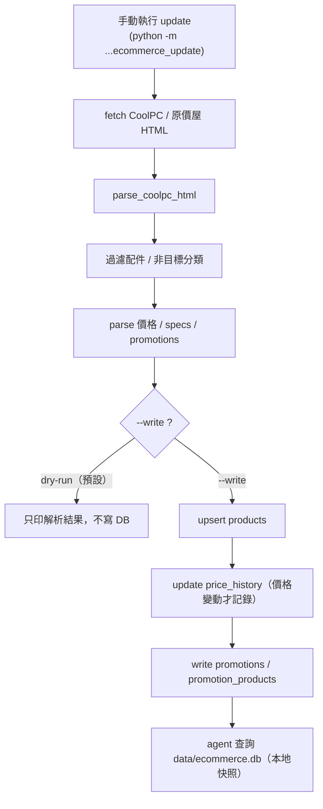
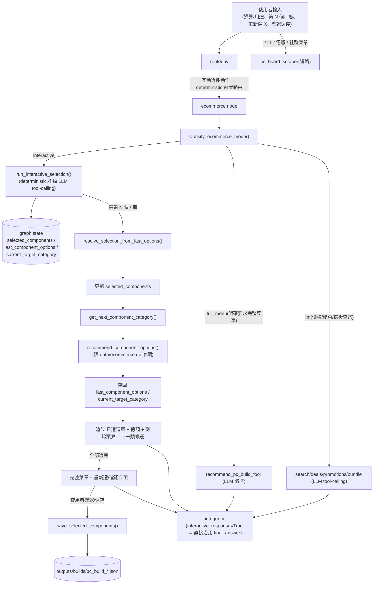

# PC Builder Agent

> ⚠️ **接入外部（同學的）零件推薦邏輯前請先確認**
>
> 如果你現在還沒有把同學的程式碼放進 repo,那就先不要讓 Claude 硬接。你應該先問同學要:
> 1. 檔案路徑
> 2. 函式名稱
> 3. 函式輸入格式
> 4. 函式輸出格式
> 5. 是否需要查 `data/ecommerce.db`
>
> 在拿到上述資訊前,系統會維持使用內建(legacy)推薦作為 fallback;接入方式見下方
> 「[候選推薦可委派給外部 recommender](#候選推薦可委派給外部-recommenderadapter)」。

## 簡介

PC Builder Agent 是一個以節點（node）與工具（tool）為核心的模組化系統，用於根據使用者偏好與需求，提供 PC 組裝建議、爬取討論版文章、以及多角色代理（agent）式的互動流程。

這是一個使用 LangGraph 建立的 multi-agent 起始範例，現在已串接 GPT API、工具呼叫與記憶體。

它會使用同一個 session id 同時保存短期對話記憶與偏好資料，方便你重跑同一組設定時延續上下文。

### 重點功能

- **節點（Nodes）**：每個 node 負責一個職責（例如：爬蟲、專家回答、整合器等）。
- **工具（Tools）**：輔助功能模組，可供 agent 呼叫（例如：爬蟲模擬、硬體資訊查詢）。
- **狀態（state）**：中心化的作業狀態（包含 `preferences`、`profile_id` 等），節點間傳遞與共享。

## 專案目錄（概要）

- **`main.py`**: 程式進入點（示範或 CLI 啟動）。
- **`pyproject.toml`**: 專案相依與建構設定。
- **`pc_builder_agent/`**: 主程式套件目錄。
  - **`nodes/`**: 節點實作目錄（例如爬蟲、專家、整合器）。
  - **`tools/`**: 工具集合（給 agent 呼叫的外部功能或模擬器）。
  - **`chatbot.py`, `cli.py`**: 與使用者互動的入口元件。
  - **`data/articles/`**: 預設或已儲存的文章資料。

## 運作流程（可直接到graph.py查看詳細流程）

1. 首先從`preference.json`讀取使用者的偏好
2. 根據偏好與需求呼叫`pc_board_scraper` 爬蟲 node，來爬取文章
3. 進入chat模式，使用者透過 CLI 或 chat 介面發出需求。
4. Router 決定需要啟動哪些 node（例如：若需要最新討論則啟動 `pc_board_scraper`）。
5. Node 呼叫 `run_agent_turn()` 與 LLM 互動，並可選擇呼叫 `tools` 提供的功能（例如 `pc_board_scraper.invoke()`）。
6. Node 處理結果並回寫到 `state`。
7. 最終由`integrator node` 或回應流程將結果呈現給使用者。

## 開發與執行

```bash
# 建立/同步虛擬環境並安裝相依
uv sync

# 執行主程式（範例）
uv run main.py

# 若要執行debug模式(輸出更多提示訊息)
uv run main.py --debug
```

### 互動式選件 CLI（正式入口，推薦）

直接啟動互動式逐步選件 CLI(**不需自行建立 /tmp 測試腳本**):

```bash
uv run python -m pc_builder_agent.cli
```

- 啟動後**直接輸入需求**即可開始,例如:
  - `我預算 30000，要組遊戲機，但我想自己挑零件，請從 CPU 開始。`
  - `我預算 20000，要組中低階文書機，請從 CPU 開始。`
- **只輸入「1」(或「我選第 2 個 / 無 / 確認」)不會開始流程**:此時沒有上一輪候選,系統會請你**先提供預算與用途**,**不會預設 gaming**。
- 指令:`reset`(重置目前選件流程 / 換新 session)、`status`(顯示目前 thread_id 與已選零件)、`exit`(或 `quit` / `q` 離開)。
- 預設使用 `data/ecommerce.db`;若尚未建立,CLI 會提示先執行 `ecommerce_update`(不 traceback)。
- 確認後保存的菜單 JSON 仍在 `outputs/builds/pc_build_YYYYMMDD_HHMMSS.json`(`outputs/` 已被 `.gitignore` 忽略)。

> console script `pc-builder-agent`(= `cli:main`)維持原本的 `run_chat`(含 preference.json / PC_Board)行為;互動式選件請用上面的 `python -m pc_builder_agent.cli`。

程式會在啟動時自動讀取專案根目錄的 `.env`，請直接把 `OPENAI_API_KEY` 放進去。

如果想指定模型，也可以設定`OPENAI_MODEL`

### 如何新增一個 Node（節點），範例請參考 node_template.py

1. 在 `pc_builder_agent/nodes/` 下新增檔案，例如 `my_new_node.py`。
2. 節點應實作一個主函式（習慣命名為 `<name>_node(state, *, model_name=None, debug=False)`），並回傳明確的字典結果。
3. 節點可使用 `run_agent_turn()` 與 LLM 互動；必要時把工具（tool）傳入 `tools=[...]`。

注意事項：

- 回傳格式應該一致且可被 router 或其他 node 消費（例如包含 `messages`、或 `response` 欄位）。

### 如何新增一個 Tool（工具），範例請參考 tool_template.py

1. 在 `pc_builder_agent/tools/` 下新增檔案並在 `__init__.py` 中匯出工具。

工具使用建議：

- 工具應保持純粹、單一職責，並避免直接修改 global state；node 負責串接工具結果並決定是否儲存。

## 共同開發流程

- 加入Collaborators → 建 feature branch → 開發並加上測試 → 發 PR。
- PR 記得描述：新增的 node/tool 目的、輸入輸出格式、必要的 state 欄位。

### 範例：測試 Node（router 範例）

示範如何直接呼叫單一 node（router），用於快速驗證路由邏輯。此腳本會對三個範例請求執行 `router_node`，並印出 `route_targets` 與 `route_reason`。

執行方式（在專案根目錄）：

```bash
uv run scripts/test_node.py
```

如果要查看或修改測試腳本，請參考專案根目錄下的 `scripts/test_node.py`。

---

## Ecommerce Recommendation Node

### 用途

`ecommerce` node 是一個電子商城商品推薦專家，負責：

- 查詢電子商城商品（依關鍵字、類別、品牌、價格區間）
- 查詢商品價格
- 尋找優惠：單品特價、以及價格低於同類平均價的商品

支援的零組件類別（8 類主流程）：

```text
CPU / GPU / Motherboard / RAM / Storage / PSU / Case / Cooler
```

- **Storage**：包含 SSD / HDD / M.2 / SATA / NVMe 等內接儲存裝置；**不含**隨身碟、記憶卡、外接硬碟。
- **Case**：包含機殼本體；**不含**機殼風扇、機殼配件（螺絲 / 側板 / 濾網 / 支架）。
- **Cooler**：CPU 散熱器，包含**空冷塔散**與 **AIO 水冷**；**不含**散熱膏 / 散熱墊 / SSD・M.2 散熱片 / 筆電散熱墊 / 機殼風扇 / 扣具・支架・配件。
- 完整菜單查詢會把 **Cooler** 納入候選類別。
- **Cooler 相容性提醒**：空冷「高度」需確認機殼支援、AIO「水冷排尺寸」需確認機殼支援、CPU socket「扣具」需確認 CPU/主機板平台支援。

> ℹ️ 資料來源有兩種：**seed demo data（示範資料，僅 CPU/GPU/Motherboard）** 與 **CoolPC（原價屋）真實資料更新流程（涵蓋上述 8 類）**。其餘商城（欣亞 / PChome / momo）尚未實作。

### 新增的檔案與責任

| 檔案 | 責任 |
| --- | --- |
| `pc_builder_agent/tools/ecommerce_db.py` | SQLite 資料層：`init_db` / `upsert_products` / `query_products` / `find_deals` / `load_seed_products` / `sanitize_product_for_llm`；**promotions 相關**：`rebuild_promotions` / `list_promotions` / `get_promotions_for_product` / `attach_promotions_to_products` / `build_promotion_summary` / `estimate_promotion_adjusted_total` / `find_compatible_bundle_discount_pairs`；**互動式選件相關**：`recommend_component_options` / `validate_selected_build` / `summarize_selected_build`，以及 selected_* 多階段比對 helper `_match_selected_product` / `_find_product_by_name`。 |
| `pc_builder_agent/tools/platform_rules.py` | 平台相容性規則的**單一真實來源**（deterministic）：晶片組→(socket, memory_generation) 對照表 `MB_PLATFORM`、`SOCKET_BRAND`、`SOCKET_DEFAULT_MEM`，以及由文字推斷的 `cpu_platform_from_text` / `mb_platform_from_text` / `cpu_brand_from_text` / `mem_from_text` / `normalize_platform`。互動式候選與相容性驗證共用此規則，**不靠 LLM 自行判斷** socket / 記憶體世代。 |
| `pc_builder_agent/tools/ecommerce_seed.py` | 示範資料 `DEFAULT_SEED_PRODUCTS`（CPU / GPU / Motherboard 共 24 筆）。 |
| `pc_builder_agent/tools/ecommerce_scraper.py` | CoolPC 抓取與解析：`fetch_coolpc_html()`（單次低頻請求）+ `parse_coolpc_html()`（類別/型號/降價/配件過濾）+ `parse_coolpc_promotions()` / `parse_promotion_signals()`（優惠訊號解析）。 |
| `pc_builder_agent/tools/ecommerce_update.py` | 手動更新流程：`update_coolpc_products()`（fetch → parse → upsert，支援 dry-run / fallback；預設一併寫入 promotions，可用 `--no-promotions` 關閉）。非 LLM tool。 |
| `pc_builder_agent/tools/ecommerce_tools.py` | 八個 LangChain `@tool`：`search_ecommerce_products`、`find_ecommerce_deals_tool`、`recommend_pc_build_tool`、`search_ecommerce_promotions`、`find_bundle_discount_pc_pairs`，以及**互動式選件三工具** `recommend_component_options_tool`、`validate_selected_build_tool`、`summarize_selected_build_tool`。 |
| `pc_builder_agent/nodes/ecommerce.py` | `ecommerce_node`：用 `run_agent_turn()` 串接上述 tools 並產生繁中建議；支援**互動式逐步選件**（從對話歷史萃取 `selected_*`）。 |
| `pc_builder_agent/graph.py` | 新增 `ecommerce` node、`ecommerce -> integrator` 邊、`BuildState` 加 `ecommerce_advice` / `ecommerce_db_path`。 |
| `pc_builder_agent/nodes/router.py` | router 可路由到 `ecommerce`（含 LLM prompt 與關鍵字 fallback）；已支援**互動式選件意圖**（候選 / 選項 / 第 N 個 / 換平台 / DDR4·DDR5 主機板 / 先選 CPU / 下一步主機板）。 |
| `pc_builder_agent/nodes/integrator.py` | 最終整合時納入 `ecommerce_advice`；支援**候選 options 模式**（保留候選清單，不改寫成唯一完整菜單）。 |

### 資料庫（database）

- 使用 **SQLite**，為**本地端**資料庫，不是線上 DB。
- 預設路徑為 `data/ecommerce.db`（相對於專案根目錄）。
- **目前不會自動建立**，需手動匯入 seed data（見下方）。
- DB 檔已列入 `.gitignore`（`data/*.db` 等），不會進版控。

### 如何手動建立本地 seed DB

在專案根目錄執行（會建立 `data/ecommerce.db`）：

```bash
uv run python -c "from pc_builder_agent.tools import ecommerce_db as db; print(db.load_seed_products('data/ecommerce.db'))"
```

說明：

- 執行後會在專案根目錄建立 `data/ecommerce.db`。
- 這是本地端 SQLite 檔案。
- 這份 DB 含 **demo seed data**（含「原價屋」「欣亞」示範來源）。

### 如何用 CoolPC（原價屋）真實資料更新 DB

`ecommerce_update` 會從 CoolPC 公開估價頁抓取、解析後寫入本地 DB（手動觸發，非自動排程）。

先 dry-run（只抓取＋解析，**不寫任何 DB**，每類別最多 20 筆）：

```bash
uv run python -m pc_builder_agent.tools.ecommerce_update --max-per-category 20
```

確認結果合理後，正式寫入本地 DB（完整解析結果）：

```bash
uv run python -m pc_builder_agent.tools.ecommerce_update --write --db-path data/ecommerce.db
```

說明與注意事項：

- 正式寫入會涵蓋 **8 類**（CPU / GPU / Motherboard / RAM / Storage / PSU / Case / Cooler）的 CoolPC 真實商品；本地實測約為 **2,300 多筆**，實際數量會**依 CoolPC 頁面當下內容變動**。
- `data/ecommerce.db` 是**本地 SQLite 檔案**，已被 `.gitignore` 排除，**不會上傳 GitHub**。
- 因此 **clone 專案後需自行執行上面的 update 指令**建立本地 DB（否則 ecommerce 查詢會回「資料庫沒有商品資料」）。
- CoolPC 資料來自其**公開估價頁**，以單次、低頻、誠實 User-Agent 抓取，不繞過任何限制。
- CoolPC 資料是**手動更新的本地快照，不是即時報價**；CoolPC **HTML 結構改版可能導致 parser 失效**，屆時需更新 `ecommerce_scraper.py`。
- 更新為**手動觸發**，沒有自動排程。
- 抓取失敗或解析為空時**不會覆蓋既有 DB**；加上 `--fallback-to-seed` 可在失敗時改用 seed data。
- 若要避免把 seed 示範資料與 CoolPC 真實資料混在一起，建議**先備份再用乾淨 DB 重建**（例如把舊 `data/ecommerce.db` 複製成 `data/ecommerce_seed_backup_*.db` 後再 `--write`；備份檔同樣被 `.gitignore` 排除）。

### Manual local DB update（手動更新本地 DB）

本專案**不做** OS cron / systemd 等自動定時更新;`data/ecommerce.db` 一律由使用者**手動**在本地端建立或更新。

重點:

1. `data/ecommerce.db` 是**本地 SQLite DB**,已被 `.gitignore` 排除,**不會上傳 GitHub**。
2. **clone 專案後,需自己在本地端建立或更新 DB**(否則 ecommerce 查詢會回「資料庫沒有商品資料」)。
3. 更新 DB **不需要重跑整個 agent**,只要執行 `ecommerce_update` module 即可。
4. **dry-run**(只抓取＋解析,**不寫任何 DB**):

```bash
uv run python -m pc_builder_agent.tools.ecommerce_update
```

5. **正式寫入**本地 DB:

```bash
uv run python -m pc_builder_agent.tools.ecommerce_update --write --db-path data/ecommerce.db
```

6. **建議正式寫入前先備份**(備份檔同樣被 `.gitignore` 排除):

```bash
cp data/ecommerce.db data/ecommerce_manual_backup_$(date +%Y%m%d_%H%M%S).db
```

7. update 流程(`--write` 時):
   - fetch CoolPC / 原價屋 估價頁 HTML
   - `parse_coolpc_html` 解析 8 類零組件(過濾配件 / 非目標分類)
   - 解析價格 / specs / promotions(優惠訊號)
   - `upsert_products`(寫入 / 更新商品)
   - 更新 `price_history`(僅在價格變動時記錄)
   - 寫入 `promotions` / `promotion_products`(預設一併寫入;可加 `--no-promotions` 關閉)
   - 之後 agent 查詢的就是本地 `data/ecommerce.db`

8. 這**不是即時查價**;資料是**本地快照**,實際價格仍以商城頁面為準。
9. 若 **CoolPC 網頁改版**,parser 可能需要更新(`ecommerce_scraper.py`)。
10. 目前真實商城資料來源為 **CoolPC / 原價屋**;**欣亞 / PChome / momo 尚未實作**。

#### 更新流程圖



> 提醒:`data/ecommerce.db` 不進 Git,**每個環境都要各自建立本地 DB**;`--write` 會**連線到 CoolPC / 原價屋**公開估價頁(單次、低頻、誠實 User-Agent)。

#### First-run(第一次 clone)行為

第一次 clone 後本地 `data/ecommerce.db` **尚不存在**。此時:

- 各 ecommerce 工具(`search_ecommerce_products` / `find_ecommerce_deals_tool` / `recommend_pc_build_tool` / `search_ecommerce_promotions` / `find_bundle_discount_pc_pairs`)**不會報錯、不會自動建立 DB、不會自動爬網、也不會編造商品**;而是回傳清楚訊息,提示先執行上面的 **update 指令**建立本地 DB。
- DB 存在但**沒有任何商品**(只有 schema)時,工具同樣會提示先執行 update 匯入商品。
- **沒有建立本地 DB 時,agent 無法查到真實商品**(完整菜單 / 優惠查詢都會請你先建立 DB)。
- `load_seed_products()` 的 **seed demo data 僅為 fallback / 示範**(少量 CPU/GPU/Motherboard),**不是正式商品資料**;正式商品請用上面的 CoolPC update 指令建立。

### 如何測試 ecommerce tools

建立 seed DB 後，可直接呼叫工具驗證：

```bash
# 查詢商品
uv run python -c "from pc_builder_agent.tools.ecommerce_tools import search_ecommerce_products; print(search_ecommerce_products.invoke({'keyword':'RTX 4060','db_path':'data/ecommerce.db'}))"

# 查詢優惠
uv run python -c "from pc_builder_agent.tools.ecommerce_tools import find_ecommerce_deals_tool; print(find_ecommerce_deals_tool.invoke({'category':'GPU','db_path':'data/ecommerce.db'}))"
```

> 若想在不污染專案的情況下測試，可改用 Python `tempfile` 建立臨時 DB，把 `db_path` 指向臨時路徑即可。

### 如何在正式對話中使用

啟動聊天模式後（`uv run main.py`），可以問：

- 「幫我找 RTX 4060 的優惠」
- 「預算 10000 以內找 GPU」
- 「幫我比較原價屋和欣亞的 RTX 4060」

提醒：

- 若尚未建立 `data/ecommerce.db`，系統會回覆「資料庫沒有商品資料」，並不會虛構商品。
- 若沒有設定 `OPENAI_API_KEY`，無法執行完整的 LLM 對話流程。

### 完整菜單推薦（recommend_pc_build_tool）— **次要模式**

> ⚠️ **這不是一般組機問題的預設行為。** 預設流程是上面「[互動式零組件候選推薦](#互動式零組件候選推薦interactive-component-selection)」的 **CPU-first 逐步選件**。只有當使用者**明確要求**「直接給我完整菜單 / 一次配好 / 不用讓我選 / 直接產生完整配置 / 給我完整 8 類菜單 / 直接幫我配好」時,才會呼叫 `recommend_pc_build_tool`。**只說「組電腦 / 遊戲機 / 預算 X」不算明確要完整菜單,仍走逐步選件。** 互動式模式與完整菜單模式並存,但**預設是互動式模式**。

當使用者**明確要求完整菜單**時,會呼叫 **deterministic 完整菜單工具 `recommend_pc_build_tool`**(定義於 `ecommerce_tools.py`,核心邏輯在 `ecommerce_db.recommend_pc_build()`),它仍可輸出 8 類完整菜單、價格摘要與優惠試算。

該工具會回傳一套**平台一致**的完整 build:

```text
CPU / GPU / Motherboard / RAM / Storage / PSU / Case / Cooler
total_price / budget_min / budget_max / budget_usage_percent / in_budget_range
compatibility(相容性摘要) / warnings / explanation
```

**預算策略**：

- 正常情況下,總價會盡量落在使用者預算的 **80%～120%**(例:預算 30000 → 目標 24000～36000)。
- 若需求與預算明顯不合理,**不會硬湊** 80%～120%:
  - 例:**50000 元文書機** → 提醒預算過高(文書合理約 16000),不硬湊。
  - 例:**10000 元 4K 遊戲機** → 提醒預算不足(4K 建議 40000 以上),不硬湊。

**gaming build 最低選品策略**：

- **RAM**:優先 DDR4 / DDR5,**至少 16GB**(不主推 8GB 單條 / DDR3)。
- **Storage**:約 **500GB 級距以上**(480GB / 500GB / 512GB / 1TB SSD),不主推 240GB / 256GB。
- **PSU**:有獨顯時優先 **550W / 650W / 750W**(不主推 400W / 450W)。
- **Cooler**:只從 `category="Cooler"` 選(空冷或 AIO),不含散熱膏 / SSD 散熱片 / 機殼風扇等配件。
- **CPU / MB / RAM**:用 specs 的 `socket` / `memory_generation` 做基本相容性檢查。

**硬體邏輯守門(deterministic,Final-QA 後)**：

`recommend_pc_build_tool` 在選 build 時會套用下列守門,避免明顯不合理或不相容的配置:

- **CPU socket 必須與 Motherboard socket 相符**。
- **Motherboard memory_generation 必須與 RAM memory_generation 相容**(選 RAM 時過濾 + 回傳前再次最終守門,不相容則放棄該平台)。
- **LGA1700 D4 / D5 主機板**:部分主機板以 `D4` / `D5` 表示 DDR4 / DDR5 版本;`recommend_pc_build` 會用**商品名稱 fallback** 判斷(名稱明確的 DDR4/DDR5/D4/D5 優先),修正 DB specs 模糊或舊誤標(例如 `H610I-PLUS D4-CSM` 視為 DDR4),避免 MB/RAM 世代錯配。
- **gaming / 4k_gaming 的主要 Storage 必須是 SSD 類型**(SSD / NVMe / M.2 / PCIe SSD / 2.5吋 SSD),**不會只因容量夠大就選純 HDD**;容量至少約 **480GB**。純 HDD(5400/7200轉、新梭魚、3.5吋)可作為**資料碟**,但**不應作為唯一主要 Storage**。
- **搭獨立顯卡時 PSU 至少約 550W**。
- **display output guard:無 GPU 的 build 必須確認 CPU 有內顯**;文書機可以沒有獨顯,但 CPU 必須有內顯。若 CPU 無內顯或無法確認(例如 Intel/AMD 的 **F 結尾型號** 如 i5-12400F / R5 8400F / R5 7500F),系統會優先**改選有內顯的 CPU**(如 AMD G/GT、Intel 非 F),找不到時才**加入一張便宜 GPU**;`compatibility` / `warnings` 會說明顯示輸出來源。

**相容性檢查程度**：

- 已做(deterministic):上述硬體邏輯守門(socket / 記憶體世代 / D4-D5 fallback / SSD 主儲存 / PSU 瓦數 / 顯示輸出)。
- **尚未檢查**:BIOS 版本相容性、機殼長度/高度細節、GPU 長度、Cooler 高度、AIO 水冷排安裝位置、PSU 接頭/顯卡供電需求、主機板 VRM/供電品質與擴充性,以及 PCPartPicker 等級的完整相容性。
- 因此完整菜單仍應視為**商城候選配置,不是已完全驗證、保證可直接購買的最終菜單**(購買前仍需人工確認;系統並未保證所有硬體完全相容)。

### MVP 已知限制

- 資料來源支援 **seed demo data** 與 **CoolPC 真實資料更新流程**（CoolPC 涵蓋 8 類,含 Cooler）。
- 真實爬蟲**目前只支援 CoolPC（原價屋）**；**欣亞 / PChome / momo 尚未實作**。
- `below_avg` 優惠**只是「低於同類平均價」的初步訊號**，不保證一定是最佳優惠（平均會被高/低階產品拉動）。
- 目前採**方案 C**，維持 `pc_board_scraper` 短路：當「PTT 菜單 + 商城優惠」**同時**被路由時，MVP 可能**只跑 PTT 菜單（pc_board_scraper），不會同時跑 ecommerce**。
- 更新為**手動觸發**，目前**沒有自動排程**。
- CoolPC 為公開 HTML 頁面，**網站結構改版可能導致 parser 失效**，屆時需更新 `ecommerce_scraper.py`。
- **硬性相容性檢查器尚未完整**:已有 deterministic 硬體邏輯守門(socket / 記憶體世代 / D4-D5 fallback / gaming SSD 主儲存 / PSU 瓦數 / 顯示輸出),但**仍未檢查** BIOS 版本、GPU 長度、機殼空間、Cooler 高度、AIO 水冷排安裝位、PSU 接頭/顯卡供電、主機板 VRM/供電/擴充性等。完整菜單仍應視為**商城候選**,**不是已驗證、保證可直接購買的完整配置**(購買前仍需人工確認;**並未保證所有硬體完全相容**)。

---

## 互動式零組件候選推薦（Interactive Component Selection）

### 目的（互動式逐步選件是**預設模式**,且為 **graph-state driven**）

**一般預算組機問題預設走 CPU-first 互動式逐步選件,不會主動直接給完整菜單。**
**此流程現在是 graph-state driven**:已選零件、上一輪候選、目前目標類別、預算與用途都存在 graph state,
「第 N 個」選擇與下一步類別由**程式狀態 deterministic 驅動**,**不再靠 LLM 自行 tool-calling 或猜測**。

> **Fresh-session guard(全 deterministic,不走一般 LLM 商品查詢)**:沒有正在進行的選件流程
> (沒有 `selected_components` / `last_component_options` / `current_target_category` / `selection_flow_complete`)時:
> - **裸輸入「1 / 我選第 2 個 / 無 / 確認 / 重新選 CPU」** → 不會開始流程、不會預設 gaming、不會更新狀態或保存;請先提供預算與用途。
> - **只給預算**(如「我預算 30000」「30000 元」「預算 3 萬」) → **問用途**(遊戲 / 文書 / 4K 遊戲 / 剪輯),不預設 gaming。
> - **只給用途**(如「我要組遊戲機」) → **問預算**。
> - **只說要組電腦 / 我想自己挑零件**(無預算無用途) → **要求提供預算與用途**。
> - **同時給預算 + 用途**(如「我預算 30000,要組遊戲機,請從 CPU 開始」) → **開始 CPU-first 候選**。
>
> 判斷依據:`is_selection_like_input` / `is_budget_only_input` / `has_active_selection_state`(`ecommerce_db.py`);
> budget / use_case 會被記住,因此「我預算 30000」之後再說「遊戲機」即可開始。

1. 使用者只要說「預算多少,要組**遊戲機 / 文書機 / 電腦**」,系統會**先推薦 CPU 候選**(2~3 個本地 DB 實品),**不會**直接輸出完整菜單。
2. **每輪只推薦目前要選的那一類** 2~3 個候選,讓使用者自己挑,不會一次把所有類別列完。
3. **固定推薦順序(deterministic,由 `get_next_component_category` 決定)**:

   ```text
   CPU → GPU/顯示卡 → Motherboard/主機板 → RAM/記憶體 → Storage/硬碟 → PSU/電源
       → Cooler/散熱器 → Case/機殼 → 完整菜單摘要 / 確認 / 保存 JSON
   ```

4. **「第 N 個 / 選 2 / 無 / 不買」由 `state.last_component_options` deterministic 解析**(`resolve_selection_from_last_options`),不靠 LLM 猜商品名;解析到的完整 `product_name / price / specs` 直接寫入 `state.selected_components`。
5. **每輪回答開頭固定顯示**(數字由 state 計算,非 LLM 心算):目前已選零件(逐項含價格)、目前總額、剩餘預算、下一步推薦類別。
6. 使用者可在**一開始指定品牌**(影響第一輪 CPU 候選):想用 **AMD** → 只給 AMD;想用 **Intel** → 只給 Intel;**AMD / Intel 都可以** → 跨平台候選(不先反問品牌)。
7. 選完 CPU 後,後續零件被 **deterministic 相容性規則限制**(不靠 LLM 判斷),依 CPU 平台推薦:
   - **AM4 CPU** → AM4 主機板(A520 / B550 / X570)+ **DDR4** RAM。
   - **AM5 CPU**(如 R5 7500F) → AM5 主機板(A620 / B650 / X670 / X870)+ **DDR5** RAM。
   - **Intel LGA1700 CPU** → LGA1700 主機板(H610 / B660 / B760 / H770 / Z690 / Z790),RAM **依主機板 DDR4 / DDR5 版本決定**。
   - **Intel LGA1851 CPU** → LGA1851 主機板(B860 / Z890)+ **DDR5** RAM。
   - 選 **DDR4 主機板**後 RAM 只會是 DDR4;選 **DDR5 主機板**後 RAM 只會是 DDR5。
8. **完整菜單是次要模式**:只有使用者**明確要求**「直接給我完整菜單 / 一次配好 / 不用讓我選 / 直接產生完整配置 / 給我完整 8 類菜單 / 直接幫我配好」時,才改用 `recommend_pc_build_tool`(見下方「完整菜單推薦」)。**只說「組電腦 / 遊戲機 / 預算 X」不算明確要完整菜單,仍走逐步選件。**

### 三個互動式工具(只讀本地 `data/ecommerce.db`,**不會寫 DB**)

> ⚠️ 這三個工具與所有 ecommerce 工具一樣,**只會讀取**本地 `data/ecommerce.db`,**絕不會寫入或重建 DB**;DB 不存在 / 無商品時會回 first-run / no-data 提示,**不編造商品**。

**1. `recommend_component_options_tool`** — 針對指定類別回傳 2~3 個相容候選。

```text
輸入：target_category(必填)、budget、use_case、remaining_budget、prefer_platform、
      selected_cpu / selected_motherboard / selected_ram / selected_gpu /
      selected_storage / selected_psu / selected_case / selected_cooler、
      selected_socket、selected_memory_generation、limit(預設 3,最多 5)、db_path
輸出：category、options(每個含 product_name / price / source / category / brand /
      model / socket / platform / memory_generation / reason / compatibility_notes)、
      constraints_applied、warnings、next_step_suggestion
```

- 候選排序刻意取**性價比 / 平衡 / 高階**三種級距,不是只回最便宜的 3 個;會避免明顯超出 `budget` / `remaining_budget`。
- 候選**不足 3 個**時會回 1~2 個並在 `warnings` 說明原因(平台/世代限制或預算上限)。

**2. `validate_selected_build_tool`** — 檢查目前已選零件是否相容。

```text
檢查：CPU socket == Motherboard socket、Motherboard / RAM memory_generation 相容、
      無 GPU 時 CPU 是否有內顯、gaming 有獨顯時 PSU >= 550W、gaming 主要 Storage 為 SSD 類
輸出：is_valid、issues、warnings、selected_summary、missing_categories、
      total_price、compatibility_summary
```

- socket / 記憶體世代**不一致**會列為 `issues` 並使 `is_valid=False`;其餘(內顯 / PSU / SSD)為 `warnings`。

**3. `summarize_selected_build_tool`** — 摘要目前進度。

```text
輸出：selected_summary、total_price、budget、remaining_budget、
      missing_categories、compatibility_summary、next_recommended_category、warnings
```

- `total_price` / `remaining_budget` 由**工具實際從 DB 取價計算**,不由 LLM 自行估算。

### Graph state 欄位(互動式選件的權威狀態來源)

互動式選件的狀態存在 `BuildState`(`graph.py`),在同一 `thread_id` 多輪對話中由 checkpointer 保留:

| 欄位 | 用途 |
| --- | --- |
| `selected_components` | 已選零件與規格的**權威來源**:`{category: {product_name, price, source, socket, platform, memory_generation, is_virtual}}`(非自然語言摘要)。 |
| `selected_budget` | 互動式選件的預算。 |
| `selected_use_case` | 用途(`gaming` / `4k_gaming` / `office`)。 |
| `current_target_category` | 目前正在挑選的類別。 |
| `last_component_options` | 上一輪推薦的候選清單,讓「第 N 個」可 **deterministic 對應**(不靠 LLM 猜)。 |
| `selection_flow_complete` | 是否已選完 CPU/GPU/Motherboard/RAM/Storage/PSU/Cooler/Case。 |
| `pending_reselect_category` | 使用者要求重新選某類別時記錄該類別。 |
| `interactive_response` | 本輪是否由 deterministic 互動式引擎產生 `final_answer`(為 True 時 integrator **直接沿用、不經 LLM 改寫**)。 |

> 因此「已選零件」不再只靠對話歷史 / LLM 萃取,而是存在 graph state;互動式選件的核心(第 N 個解析、下一步類別、selected_components 更新、保存)全部在 `ecommerce_db.run_interactive_selection()` 內 deterministic 完成。

### 互動式流程(state-driven,接到現有 graph)



流程說明:

- **互動式路徑不再依賴 LLM 自行 tool-calling 產生候選**:`ecommerce` node 偵測到互動動作後,呼叫 `run_interactive_selection()`(純程式)讀寫 graph state、deterministic 解析「第 N 個」、決定下一類、產生候選與 `final_answer`;`integrator` 看到 `interactive_response=True` 就**原樣沿用**該答案,**不經 LLM 改寫**。因此互動流程**不會跳過工具或自寫候選**。
- **非互動查詢**(價格 / 優惠 / 搭板 / 明確完整菜單)**仍走原 LLM tool-calling 路徑**(`search_ecommerce_products` / `find_ecommerce_deals_tool` / `find_bundle_discount_pc_pairs` / `recommend_pc_build_tool`)。
- **PTT / 電蝦 / 社群菜單仍走 `pc_board_scraper`**(短路行為不變)。

各節點行為:

1. **router.py**:對**互動選件動作**(第 N 個 / 無 / 重新選 X / 確認保存 / 從 CPU 開始 / 候選 / 預算組機 / 指定 AMD·Intel)用 **deterministic 前置路由**直接導向 `ecommerce`(不經 LLM,避免選件中途被誤路由);**純規格比較**(RTX 5070 vs 5060 Ti)仍走 `gpu_specialist`;**PTT / 電蝦**仍走 `pc_board_scraper`。
2. **ecommerce node**:`classify_ecommerce_mode()` 分流 `interactive` / `full_menu` / `llm`;互動模式走 `run_interactive_selection()`(state-driven、deterministic),其餘維持 LLM tool-calling。
3. **integrator**:`interactive_response=True` 時**直接沿用** deterministic `final_answer`(不改寫、不擴成完整菜單);其餘維持原整合行為。

### Deterministic 相容性規則

互動式候選與驗證套用下列規則(規則來源集中於 `platform_rules.py`,**不靠 LLM 判斷**):

1. **CPU socket 必須等於 Motherboard socket**。
2. **RAM memory_generation 必須符合 Motherboard memory_generation**。
3. **DDR4 主機板只能搭 DDR4 RAM**。
4. **DDR5 主機板只能搭 DDR5 RAM**。
5. **AM4**：CPU Ryzen 3000/4000/5000(含 G/GT)；MB **A520 / B550 / X570**；RAM **DDR4**。
6. **AM5**：CPU Ryzen 7000/8000/9000；MB **A620 / B650 / X670 / X870**；RAM **DDR5**。
7. **Intel LGA1700**：CPU 12/13/14 代;MB **H610 / B660 / B760 / H770 / Z690 / Z790**；RAM **依主機板 DDR4 / DDR5 / D4 / D5 版本決定**(未明確時同時列出並提醒先確認)。
8. **Intel LGA1851**：CPU Core Ultra 200;MB **B860 / Z890**；RAM **DDR5**。
9. **gaming / 4k_gaming 的主要 Storage 優先 SSD / NVMe / M.2 / PCIe**,**不把純 HDD 當主系統碟**。
10. **有獨顯時 PSU 至少約 550W**(高階顯卡建議更高)。
11. **無 GPU 時 CPU 必須有內顯**,否則 `warnings` 會**提醒需要獨立顯卡**。
12. 規格不足以確認相容性時,**不臆測**——該候選降低優先級或標記「需人工確認」。

### 虛擬「無」選項(GPU none / Cooler none)

**GPU「無獨立顯示卡（使用 CPU 內顯）」**:
1. `office / 文書機`且**已選 CPU 有內顯**時,GPU 候選會包含此選項:`price = 0`、`source = "virtual_option"`、`is_virtual = true`。
2. **CPU 無內顯**時,不提供此選項,並**提醒需要獨立顯卡**才有畫面輸出。
3. `gaming / 4k_gaming` **預設不提供** GPU none(預設推真實顯卡),除非使用者明確說可接受內顯 / 先不買顯卡 / 極低預算。

**Cooler「無額外散熱器」**:
1. Cooler / 散熱器階段**永遠固定**包含:2~3 個實體散熱器候選 + **1 個「無額外散熱器」**選項。
2. 「無額外散熱器」:`price = 0`、`source = "virtual_option"`、`is_virtual = true`。
3. **高功耗 / K / X3D / 高階 CPU** 選「無」時,`warnings` 會提醒確認 CPU 盒裝原廠散熱器、機殼散熱與 CPU 溫度。

> 虛擬「無」選項在 `selected_components` / summarize / 保存 JSON 都會以 `price = 0`、`is_virtual = true` 如實保存。

### office / 文書機 CPU:內顯優先 + 價值過濾

`use_case = office`(文書機 / 中低階文書機 / 辦公機)時,CPU 候選會:
1. **優先有內顯 CPU**(deterministic 以 `_cpu_has_igpu` 判斷;DB 內顯 CPU 足夠時候選全部有內顯),讓下一輪 GPU 能合理提供「無獨立顯示卡」。
2. **價值過濾**:避免高階遊戲 / 高功耗 CPU 進入文書主推,排除 **X3D、Ryzen 9 / R9、Intel i9 / Core Ultra 9、Intel K / KF**,以及**明顯超出文書需求的高價 CPU**(文書 CPU 約 ≤ 預算 45%,且設絕對上限約 10,000 元)。
3. 偏好 **AMD G / GT、Intel 非 F、低價 / 主流入門中階**。
4. **預算很高但用途是 office** 時,**不硬推高階 CPU**,並提醒「文書機通常不需要花到這麼高」。
5. 若 DB 中文書合理 CPU 不足,才 fallback 並加 `warnings`(候選可能偏高階)。
6. `gaming / 4k_gaming` **不套用**此價值過濾(可正常推高階 / 無內顯 CPU)。

### gaming CPU:依預算級距推薦(高預算不主推中低階 CPU)

`use_case = gaming / 4k_gaming` 時,CPU 候選會依**整機預算級距** deterministic 調整(`_gaming_cpu_min_price`):

- **預算 ≤ 25,000**:無門檻,入門 / 中階 CPU(R5 / i5 等)皆可。
- **25,000 < 預算 ≤ 50,000**:CPU 最低約 `預算×6%`(下限 3,500 元),排除極低階,但**不過度拉高**。
- **預算 > 50,000(高預算)**:CPU 最低約 `預算×10%`(下限 8,000 元),**主推中高階 / 高階遊戲 CPU**(X3D、高階 Ryzen 7 / Ryzen 9、Intel Core Ultra 7 / 9、i7 / i9 等),**不把 i5-12400F / R5 5500 / R5 5600 這類中低階 CPU 放前 2~3 主推**。
- 較入門的 CPU 會以「**省預算 alternative**」列在 `warnings`,**不放進主要候選**;DB 高階候選不足時才退回原候選。
- `constraints_applied` 會顯示 `gaming高預算級距:CPU>=~N元`。**此規則與 office 價值過濾互斥**:gaming 高預算→升級 CPU;office 高預算→不硬推高階。

> **中文金額解析**:預算 parser(`_extract_budget_from_text`)支援中文金額,例如 **十萬 / 10萬 / 三萬 / 兩萬 / 一萬五 / 5萬5 / 十二萬 / 1.5萬**(萬 = ×10000;『X萬Y』的 Y 為千位)。並**避免把商品型號數字當預算**(RTX 5070 / i5-12400F / B650 / DDR5 不會被誤判);阿拉伯數字需有預算語境(預算 / 元 / 塊 / $)或整句即為數字才採用。因此「**預算十萬元,組遊戲機**」會解析成 budget=100000、use_case=gaming 並直接開始 CPU-first。

### 各類別的 use_case + 預算級距過濾(deterministic)

除了 CPU,其餘類別也有 deterministic 的 tier 過濾(只在 ≥2 個候選符合時才收斂,否則退回原候選並提示):

- **GPU(gaming)**:
  - **排除工作站 / 專業卡**:`_is_workstation_gpu`(RTX Ada workstation 如 RTX 2000/4000/6000 Ada、Quadro、Tesla、RTX A 系列、Radeon Pro / FirePro、**Intel ARC PRO**、ProArt / Creator / Workstation / 繪圖卡、ECC、CMP)→ 不放 gaming 主推。
  - **預算級距最低價**(`_gpu_min_price`):>60,000 → ≥ `預算×20%`(下限 16,000);40k–60k → ≥`×15%`(下限 9,000);25k–40k → ≥`×10%`(下限 6,000);≤25k 無門檻。因此 **80,000 gaming 不會主推 8k 入門卡或 RTX 2000 Ada / ARC PRO**;較入門卡列為 warning 省預算選項。
- **RAM**:排除 **ECC / 伺服器(Reg/RDIMM)記憶體**;高預算 gaming(>50k)優先 **32GB+**。DDR4/DDR5 仍須與主機板一致。
- **Storage**:gaming 主系統碟必為 SSD/NVMe(已在過濾層保證);高預算 gaming(>50k)優先 **1TB+**。
- **PSU**:依預算 / 已選 GPU 等級設瓦數下限(gaming >60k → ≥750W;已選 GPU ≥20k → ≥750W、≥30k → ≥850W);**低預算(≤35k)不硬推 >850W**;有獨顯仍 ≥550W。
- **Motherboard**:socket / 記憶體世代仍由相容性守門;高預算(>50k)或高階 CPU(X3D / R9 / i9 / K)時**避免只推最低階供電板**(設價格下限),較入門板列為 warning。
- **Cooler**:固定 2~3 實體 + 「無額外散熱器」;高功耗 / K / X3D / 高階 CPU 選「無」會給 warning。
- **Case**:高預算(>50k)避免只推超便宜小機殼,並 **warning 提醒確認顯卡長度 / 散熱器高度 / airflow**。

> 這些 tier 規則皆 deterministic(不靠 LLM),會在 `constraints_applied` 顯示(如 `gaming GPU:排除工作站/專業卡`、`高預算 gaming:RAM>=32GB`、`PSU>=~750W`),省預算替代品放 `warnings`。

### 候選推薦可委派給外部 recommender(adapter)

**「要推薦哪些零組件候選」的邏輯已抽成可委派的 adapter**:互動流程(state-driven 選件、reselect、JSON 保存、DB guard、中文預算解析、基本相容性 safety validation)由本專案負責;**實際挑哪 2~3 個候選可交給外部 recommender**(例如同學的實作)。

- 入口:`ecommerce_db.recommend_component_options(...)` 是 **dispatcher**:
  - `USE_EXTERNAL_COMPONENT_RECOMMENDER=True` 且已註冊外部 recommender → 走**外部 + adapter**;
  - 否則(預設 False)或外部失敗 → **安全 fallback** 到 legacy 內建推薦(`_recommend_component_options_legacy`,含上面的 tier/ranking)。**目前預設用 legacy,功能不變。**
- **接入方式**(兩種,擇一):
  1. **程式註冊**:`set_external_component_recommender(fn)` + 設 `USE_EXTERNAL_COMPONENT_RECOMMENDER=True`。
  2. **環境變數(零改碼)**:`PC_BUILDER_EXTERNAL_RECOMMENDER="your_pkg.module:your_func"`,系統啟動時自動載入並啟用。
- **外部函式介面**:`fn(context: dict) -> list[dict]`。`context` 含 `target_category / budget / use_case / remaining_budget / total_selected_price / prefer_platform / selected_components(各類規格)/ selected_cpu…selected_case / constraints(socket / memory_generation / brand)/ cpu_has_igpu / db_path`。回傳每個候選 dict 可為**原始 DB 商品**或**已成形 option**,至少含 `product_name / price`,可附 `source / source_url / socket / platform / memory_generation / reason(或 recommendation_reason)`。
- **adapter 會做**:正規化成現有 options schema(`category / product_name / price / source / source_url / socket / platform / memory_generation / reason / compatibility_notes / is_virtual`,**不外洩** id / dedup_key / model_key / 時間戳記)、**最小 safety validation**(CPU/MB socket 不符、MB/RAM 世代不符、品牌不符 → 過濾並 warning)、以及**固定虛擬「無」選項**(Cooler 一律「無額外散熱器」;office + 內顯 CPU 的 GPU「無獨立顯示卡」;無內顯 CPU 不給 GPU none)。
- **legacy tier/ranking 仍保留**作為 fallback;啟用外部 recommender 後,候選改由外部決定,但相容性 safety 與虛擬「無」仍由本專案把關。
- **接入點套件**:`pc_builder_agent/recommenders/`(`external_adapter.py` 內有完整介面契約 docstring + `example_recommend` **範例/參考**實作 + `CONTEXT_FIELDS` / `OPTION_FIELDS`)。**正式上線請把同學的函式放進 repo(例如 `pc_builder_agent/recommenders/classmate.py` 的 `recommend`),再以環境變數指向它。**
- **fallback 策略(明確)**:外部**正常** → 用外部候選;外部**回傳空 / 無有效候選** → 加 warning 並 fallback legacy;外部**出錯** → 不 traceback、加 warning 並 fallback legacy;外部**回不相容候選** → safety filter 過濾 + warning。legacy 只是備援,不是主路徑。
- **目前狀態**:repo 內**尚未**放入同學的正式 recommender,故預設 `USE_EXTERNAL_COMPONENT_RECOMMENDER=False`(走 legacy)。已驗證:設 `PC_BUILDER_EXTERNAL_RECOMMENDER="pc_builder_agent.recommenders.external_adapter:example_recommend"` 後,候選即由外部範例決定(CLI 顯示「範例 recommender…」),safety / 虛擬「無」/ fallback 皆正常。

  ```bash
  # 端到端啟用外部 recommender(範例;正式請改指向同學的函式)
  PC_BUILDER_EXTERNAL_RECOMMENDER="pc_builder_agent.recommenders.external_adapter:example_recommend" \
      uv run python -m pc_builder_agent.cli
  ```

### 完整菜單完成後的操作選單(1~9)

選完 CPU / GPU / Motherboard / RAM / Storage / PSU / Cooler / Case 後(`selection_flow_complete = True`),系統顯示完整菜單與總價 / 預算 / 差額,並列出操作選單:

```text
1. 確認此菜單
2. 重新選 CPU
3. 重新選顯示卡
4. 重新選主機板
5. 重新選記憶體
6. 重新選硬碟 / 儲存
7. 重新選電源
8. 重新選散熱器
9. 重新選機殼
```

- **完整菜單狀態下,輸入 1~9 由 `parse_completed_menu_action` deterministic 解析**(不靠 LLM 猜):

  | 輸入 | 動作 | | 輸入 | 動作 |
  | --- | --- | --- | --- | --- |
  | `1` | 確認並保存 JSON | | `6` | 重新選 Storage / 硬碟 / 儲存 |
  | `2` | 重新選 CPU | | `7` | 重新選 PSU / 電源 |
  | `3` | 重新選 GPU / 顯示卡 | | `8` | 重新選 Cooler / 散熱器 |
  | `4` | 重新選 Motherboard / 主機板 | | `9` | 重新選 Case / 機殼 |
  | `5` | 重新選 RAM / 記憶體 | | | |

  也接受文字「確認此菜單 / 保存 / 重新選 CPU / 換顯示卡 / 顯示卡太貴」等。
- **非完整狀態下,數字 `1~N` 仍代表上一輪候選清單的第 N 個**(`resolve_selection_from_last_options`),**不會**被誤判成完整菜單操作。判斷依據是 `completed = bool(selected_components) and get_next_component_category(...) is None`。
- 整個流程由 **graph state(`selected_components` / `last_component_options` / `selection_flow_complete`)+ `parse_completed_menu_action` 驅動**,**不靠 LLM 猜測**。

### 重新選零件與相依項處理(reselect)

使用者可用操作選單(2~9)或文字「重新選 X / 換 X / X 太貴」進入重選。系統會**保留其他 `selected_components`**、設 `pending_reselect_category`,並 **deterministic 自動移除可能不相容的相依零件**(`_reselect_remove_dependents`),要求一併重選。被重選的類別本身先移除待重選,接著回到**第一個缺少的類別**繼續推薦。

1. **重新選 CPU**:替換 `selected_components["CPU"]`;**自動移除 Motherboard / RAM / Cooler**(socket / 世代 / 扣具可能變)。若 **GPU 是「無獨立顯示卡」且新 CPU 無內顯**,GPU 也會被移除要求重選;**實體顯卡通常保留**。下一步回到第一個缺少類別(GPU 保留 → Motherboard;GPU 被移除 → GPU)。
2. **重新選 GPU**:替換 GPU;**自動移除 PSU**(功耗 / 接頭可能變),要求重選電源。**Case 不自動移除**,但會提醒確認顯卡長度與機殼空間。下一步回到 PSU(或第一個缺少類別)。
3. **重新選 Motherboard**:替換主機板;**自動移除 RAM**(DDR4 / DDR5 可能改變)。**Cooler 不一定自動移除**,但會提醒確認扣具 / socket / 高度。下一步 RAM。
4. **重新選 RAM / Storage / PSU**:通常只替換該類別並重新計算總價,不影響其他零件。
5. **重新選 Cooler**:Cooler 候選仍含 **2~3 個實體散熱器 + 1 個「無額外散熱器」**;**Case 不自動移除**,但提醒確認散熱器高度 / AIO 水冷排安裝位。
6. **重新選 Case**:通常只替換機殼,並提醒確認 GPU 長度、Cooler 高度、AIO 水冷排與主機板尺寸。

> reselect 採**保守相容策略**:會**自動移除可能不相容的相依零件**(寧可請使用者重走,也不留下不相容組合)。被替換 / 移除後都會**重新計算總額與剩餘預算**,並以 `selected_components` 為準顯示。

### 完整菜單確認與保存 JSON

1. 完整菜單完成後,輸入 **「1 / 確認此菜單 / 確認 / 就這套 / 保存 / 存成 JSON」** 會**直接視為確認並保存 JSON**(一致策略,不再二次詢問)。
2. **未選完所有必選項前不允許保存**,會提醒還缺哪些類別;選件途中**不會自動保存**。
3. 保存路徑:`outputs/builds/pc_build_YYYYMMDD_HHMMSS.json`(**不覆蓋舊檔、不寫入 `data/`**)。由 `save_selected_components()` **直接從 `state.selected_components`** 產生,不再要 LLM 重整商品名。**再次確認會產生另一份新的 JSON**(不覆蓋)。
4. JSON 內容:`created_at`、`budget`、`use_case`、`total_price`、`remaining_budget`、`components`(每件含 category / product_name / price / source / socket / platform / memory_generation / is_virtual)、`compatibility_summary`、`warnings`。
5. **JSON 是使用者本地保存結果,不代表商城訂單**;**`outputs/` 已被 `.gitignore` 忽略**,不應 commit。

### `selected_*` 商品名稱比對策略(Simplify-C2 改進)

互動式選件的「第 N 個 / 無」現在由 **`state.last_component_options` deterministic 解析**(`resolve_selection_from_last_options`),**不再靠 LLM 複製商品名**,因此一般逐步選件不會有名稱對不上的問題。下列多階段比對主要用於:(a) 使用者**直接打商品名 / 部分型號**、(b) summarize / validate / save 以名稱回查、(c) LLM 完整菜單路徑。為避免名稱輕微改寫(例如 `↑5.0G` 寫成 `最高5.0G`、多/少空白、省略型號)對不到商品:

1. 互動式 deterministic 路徑優先以 `state.last_component_options[N-1]` 取得完整 `product_name`,無需 LLM 改寫。
2. 工具層另有**多階段比對**找回 DB 商品,階段(由精確到寬鬆)為:
   - **exact** `product_name` 完全相等
   - **normalized text match**(NFKC 全半形統一、小寫、去掉 `↑`/`最高`、移除空白標點後比對 / 包含)
   - **model_key / normalized_model_key**(需共享足夠長度的前綴,避免短鍵亂中)
   - **brand + model token**(品牌 + 型號 / 晶片組 / 記憶體世代 token)
   - **category-constrained lookup**(一律限定 category,避免跨類別誤配;並對記憶體世代 / 晶片組做硬性約束,例如「H610 DDR4」不會誤配到 DDR5 板)
3. 若比對結果**ambiguous**(多筆同分),工具會選最合理者(較便宜)並加 `warning`,**不會任意編造**。
4. 若**完全找不到** DB 商品,會回 `found=False` 並提示請改用完整 `product_name`,**不會自行捏造價格**。

### 限制(互動式選件)

1. 互動式選件**依賴本地 `data/ecommerce.db`**;**第一次 clone 後需先手動 update 建立 DB**(見上方更新章節),否則工具會回 first-run 提示。
2. 若 DB 沒有某商品,工具**不會編造**(回 no-data / `found=False`)。
3. 目前相容性檢查**主要涵蓋** CPU socket、Motherboard socket、RAM 記憶體世代,以及基本的 **SSD 主儲存 / PSU 瓦數 / iGPU(顯示輸出)守門**。
4. **尚未完整檢查**:BIOS 版本、GPU 長度、機殼空間、Cooler 高度、AIO 水冷排安裝位、PSU 接頭 / 顯卡供電、主機板 VRM / 供電 / 擴充性等。
5. `selected_*` 的 fuzzy matching 可提升穩定性,但使用者**直接打商品名**且 ambiguous 時,仍建議提供完整商品名稱。
6. **已選零件存於 graph state 的 `selected_components`**(同一 `thread_id` 多輪保留),不再只靠對話歷史 / LLM 摘要;互動式選件的第 N 個解析、下一步類別、保存皆 deterministic。
7. 目前相容性檢查為**基本 deterministic 檢查,並非完整硬體保證**;**尚未完整檢查** BIOS、GPU 長度、機殼空間、Cooler 高度、AIO 水冷排安裝位、PSU 接頭 / 顯卡供電、主機板 VRM / 供電 / 擴充性等。
8. 真實商品資料來源仍是 **CoolPC / 原價屋本地快照,不是即時商城價格**;保存的 **JSON 是使用者本地保存結果,不代表商城訂單**;**並未保證所有硬體完全相容**,購買前仍需人工確認。

---

## 商城優惠（Promotions）與優惠試算

除了商品本身,系統還會記錄 CoolPC 頁面中**明確可見、可解析**的優惠訊號,並在完整菜單中作為**參考資訊**呈現。**優惠資訊一律不會自動扣除總價、不會改變選品。**

### Promotions 已正式入庫

- promotions 已正式寫入**本地 SQLite DB**（`data/ecommerce.db`）。
- 新增兩張資料表：

```text
promotions            # 一筆優惠(型別/標題/原文/折扣金額/條件/信心度…)
promotion_products    # 優惠與商品的關聯(product_role: trigger/target/member/unknown)
```

- promotions **只會寫入能關聯到 8 類正式零組件**（CPU / GPU / Motherboard / RAM / Storage / PSU / Case / Cooler）的商品。
- **非 8 類商品**（整機 / 筆電 / 準系統 / 周邊等）目前**不會寫入 promotion DB**，以避免污染完整菜單推薦（實測 orphan promotions = 0、無非 8 類污染）。

### 目前支援的 promotion 類型

| 類型 | 說明 | 是否計入優惠試算折抵 |
| --- | --- | --- |
| `actual_discount` | 單品特價（`original_price > discount_price`）。折扣**通常已反映在商品目前售價中**。 | **否**（不會再次扣除總價，避免重複折扣） |
| `bundle_discount` | 搭配折扣，例如「CPU 搭主機板現省」。 | **僅在條件成立時**（見下方）才試算 |
| `text_promo` | 文字型活動，例如憑發票、登錄活動、活動提醒。 | **否**（只作為提醒，不自動扣總價） |

關於 `below_avg`：

- **`below_avg` 不是 promotion**，只是「低於同類平均價」的初步價格參考訊號。
- 它**不會寫入 promotions**，也**不會**進入 `applied_promotions` 或影響 `estimated_final_price`。

### 唯讀查詢工具：`search_ecommerce_promotions`

新增的唯讀 LangChain `@tool`，可查詢目前 DB 中的優惠：

- 可依 `promo_type`（`actual_discount` / `bundle_discount` / `text_promo`）、`category`、`keyword` 查詢。
- **只會回傳能關聯到 8 類商品的優惠**，並保留原始 `promo_text` 供人工確認。
- **不會**修改 DB、**不會**套用折扣、**不會**改變完整菜單總價；回傳已 sanitize（不含任何 DB internal id）。

### 搭板優惠相容配對工具：`find_bundle_discount_pc_pairs`

`find_bundle_discount_pc_pairs` 是一個 **deterministic、唯讀**的工具，用途：

> 找出有 `bundle_discount` / 搭主機板現省優惠的 CPU，並**自動配對相容主機板**，回傳原始總價、可計算優惠折抵、預估優惠後總價與相容性說明。

當使用者問「搭主機板現省 / 搭板專案 / CPU 搭主機板折扣 / 有 bundle_discount 的 CPU 並搭主機板」時，ecommerce node 會**優先呼叫此工具**，而不是讓 LLM 自己用 `search_ecommerce_promotions` + `search_ecommerce_products` 手湊、手算折扣。

**與一般 promotion 查詢工具的差別：**

| 工具 | 職責 |
| --- | --- |
| `search_ecommerce_promotions` | **只查 promotion 資料**（actual_discount / bundle_discount / text_promo），**不負責**配對相容主機板，也不試算搭配折扣。 |
| `find_bundle_discount_pc_pairs` | 會做 **CPU + Motherboard 相容配對**，並用守門邏輯**試算可計算的搭配折扣**（estimated_final_price）。 |

**相容性守門規則（安全保證）：**

1. **只回傳相容** CPU + Motherboard pairing。
2. CPU `socket` 必須等於 Motherboard `socket`。
3. `memory_generation` 不可明顯衝突（如 DDR5 vs DDR4）。
4. **AM5 CPU 不可搭 A520 / B550**（那是 AM4）。
5. **AM4 CPU 不可搭 A620 / B650 / X670 / X870**（那是 AM5）。
6. specs 不足、無法確認相容時，**不會**自動視為可套用折扣（不列入結果或標為需人工確認）。
7. 回傳的 `estimated_final_price` 是**試算**，**不是保證結帳價**。
8. **實際結帳仍以 CoolPC 商城頁面為準。**
9. **唯讀**：不寫 DB、不修改任何商品價格。

**回傳重點欄位：**

```text
cpu_product_name / cpu_price / cpu_socket / cpu_memory_generation
motherboard_product_name / motherboard_price / motherboard_socket / motherboard_memory_generation
promo_type / promo_text / discount_amount
total_price / estimated_discount_amount / estimated_final_price
compatibility_status / compatibility_reason / promotion_price_note / source
```

**不會回傳**任何內部欄位：`id` / `product_id` / `promotion_id` / `dedup_key` / `model_key` / `promo_key` / `created_at` / `updated_at`。

**目前限制：**

1. 目前主要處理 **CPU + Motherboard** 的搭板折扣配對。
2. 會挑相容主機板候選（通常取最便宜的相容板），但**不代表**該主機板在效能、供電（VRM）、擴充性上最理想。
3. 高階 CPU 搭低階相容板雖然 socket 相容，**仍建議人工確認**供電、BIOS、散熱與擴充需求。
4. promotion **不會**影響一般完整菜單（`recommend_pc_build_tool`）的選品排序。
5. `estimated_final_price` 不是保證結帳價。
6. **尚未支援**購物車 / 結帳頁最終價格同步。
7. **尚未支援**欣亞 / PChome / momo 的 bundle promotion。

### `recommend_pc_build_tool` 的優惠相關行為

完整菜單工具新增參數與回傳欄位（皆為**參考資訊**，不影響選品）：

- 參數：`include_promotions`（附上每件商品的 `promotions` 與整體 `promotion_summary`）、`estimate_promotions`（額外試算 `estimated_final_price`）。
- 回傳新增：`promotion_summary` / `estimated_discount_amount` / `estimated_final_price` / `applied_promotions` / `unapplied_promotions` / `promotion_price_note`。

兩個總價的明確定義：

```text
total_price            = 原始商品目前售價加總，不會被優惠試算覆蓋。
estimated_final_price  = 僅試算「可確認條件成立的高信心 bundle_discount」後的預估價格。
```

`bundle_discount` 進入優惠試算（`applied_promotions`）的條件（全部成立才計入）：

1. `confidence == "high"`。
2. `discount_amount` 有值且 > 0。
3. build 中能確認 `required_category` 存在（例如 `required_category="Motherboard"` 時，build 真的有 Motherboard）。

未滿足條件的 `bundle_discount` 會列入 `unapplied_promotions`（附原因），**不會**計入折抵。

### 固定價格摘要

完整菜單回答會固定顯示一個「價格摘要」區塊：

```text
原始總價
可計算優惠折抵
預估優惠後總價
實際結帳價格仍以商城為準
```

即使「可計算優惠折抵」是 **0 元**，也會完整顯示（不省略）：

```text
- 原始總價：30,937 元
- 可計算優惠折抵：0 元
- 預估優惠後總價：30,937 元（等於原始總價）
- 說明：目前沒有可自動試算的搭配折扣；單品特價通常已反映在商品目前售價中，實際結帳仍以商城為準。
```

### 目前限制（Promotions）

1. `estimated_final_price` **不是保證結帳價**，只是試算。
2. **實際結帳價格仍以 CoolPC 商城頁面為準。**
3. `actual_discount` **不會重複扣**（折扣已反映在目前售價）。
4. `bundle_discount` **只在可確認條件成立時**才試算。
5. `text_promo` **不會扣總價**（僅活動提醒）。
6. `below_avg` **不屬於 promotion**。
7. 目前**不會讓 promotion 影響選品排序**。
8. 目前**不會因 promotion 自動改變 build**。
9. **尚未支援**真正購物車層級的結帳價同步。
10. **尚未支援**欣亞 / PChome / momo 的 promotion。

---
